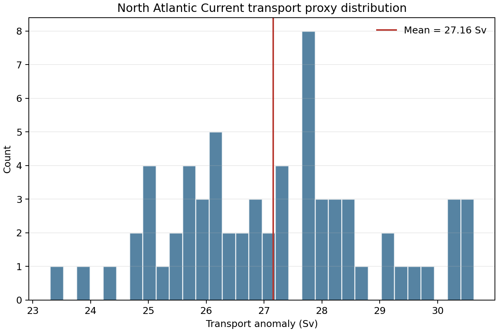
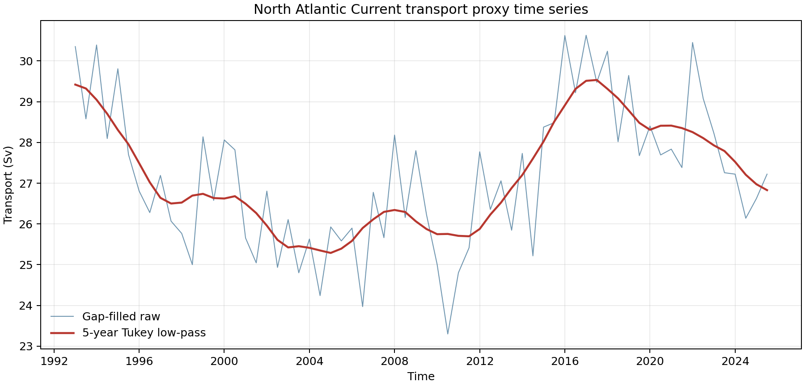
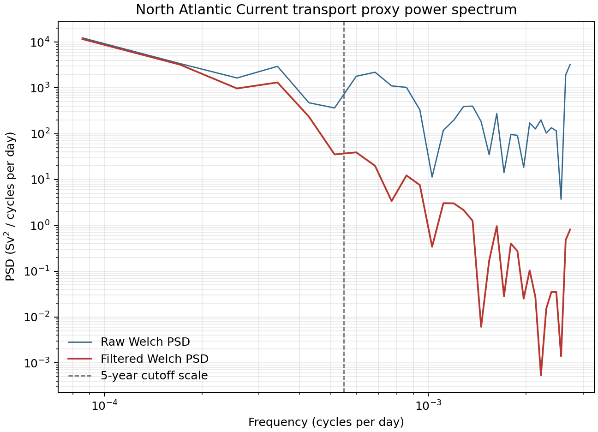

# Assignment 1: Characterising a NAC AMOC Time Series

BBF0104yuxiangluan

## Data choice

This analysis uses the North Atlantic Current (NAC) dataset from AMOCatlas and
the `TRANS_NAC_PROXY` variable. This series is a six-monthly transport proxy in
Sverdrups (Sv), based on satellite altimetry and float observations. I chose the
NAC dataset because it provides an AMOC-relevant North Atlantic transport time
series and does not duplicate the datasets selected by other students.

The record spans 1993-01-01 to 2025-07-02. It contains 66 samples, with a median
sampling interval of 182.625 days. There are no missing values in the proxy
series, so no interpolation was needed. The gap-filling step in the script is
kept for reproducibility, but it leaves this particular series unchanged.

## Time-domain statistics

The NAC transport proxy has a mean of 27.16 Sv and a standard deviation of
1.74 Sv. The median is 27.21 Sv. The minimum and maximum are 23.30 Sv and
30.63 Sv, giving a total range of 7.33 Sv. The histogram shows that the values
are concentrated around the high-20s Sv, with variability of a few Sverdrups
around the mean.



The raw time series shows interannual to decadal variability in the NAC
transport proxy. Because the data are sampled every six months, I applied a
5-year Tukey-window low-pass filter using an 11-sample centred rolling window.
This filter suppresses shorter interannual fluctuations and highlights slower
multi-year changes in the transport proxy.



## Frequency-domain statistics

I estimated the power spectral density using Welch's method with a Hann window,
a 64-sample segment length, and no overlap. The record is short, so this
configuration is close to a tapered periodogram, but it keeps nearly the full
record length and gives a stable variance budget. The segment length corresponds
to about 32 years because the sampling interval is approximately half a year.

The integrated spectrum satisfies the Parseval variance check. The ratio between
integrated PSD and time-domain variance is 0.996 for the raw series, which is
very close to 1. This indicates that the spectral normalisation is consistent
with the variance of the time series. The largest spectral peak in this estimate
corresponds to a timescale of about 32 years. Given the short record, this peak
should be interpreted cautiously as low-frequency variability over the full
record rather than as a precisely resolved oscillation.

The 5-year Tukey low-pass filter reduces power at higher frequencies while
retaining the lower-frequency part of the spectrum. The filtered spectrum lies
below the raw spectrum at shorter timescales, which is the expected behaviour of
a low-pass filter designed to isolate slower AMOC-related transport variability.



## Reproducibility

The analysis can be reproduced with:

```bash
python assignment_analysis.py
pytest -q
```

The script downloads/loads the NAC dataset through AMOCatlas, writes the figures
to `figures/`, and writes the numerical summary to
`outputs/assignment1_summary.json`.
