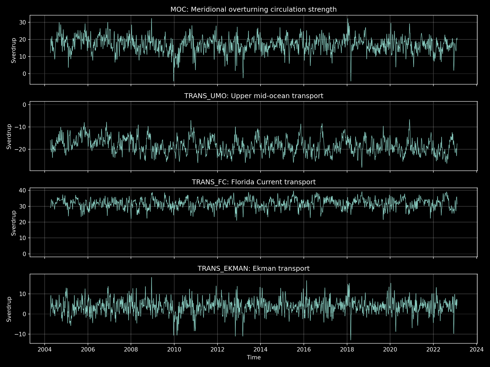
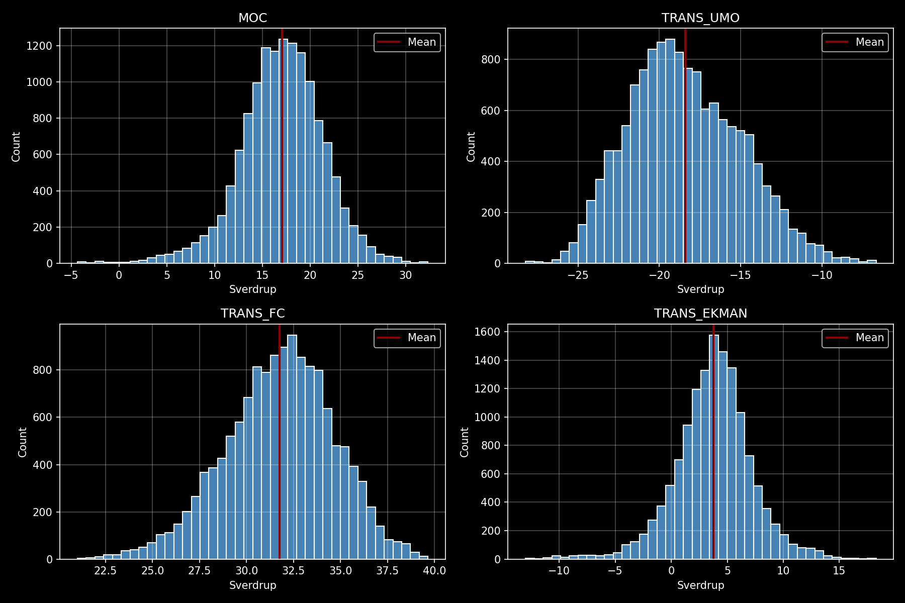
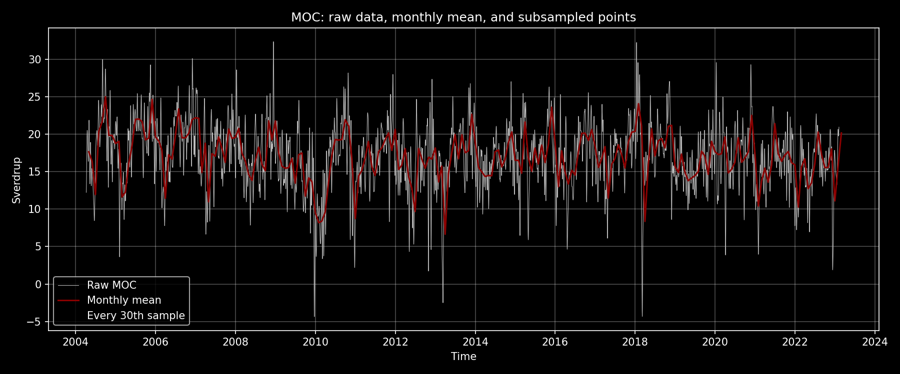

# Exercise 1: RAPID AMOC Data Exploration

## Aim

The aim of this exercise is to explore RAPID 26N AMOC component transport data
using Python and `amocatlas`, then describe the data with plots and basic
statistics.

## Data

The analysis uses the RAPID layer transport file:

`data/moc_transports.nc`

This file contains the component transports used in Lecture 1, including MOC,
UMO, Florida Current, and Ekman transport. The dataset spans 2004-04-02 to
2023-02-11 with 13,779 samples. The most common sampling interval is 12 hours.

## Methods

The notebook `notebooks/exercise1.ipynb` performs the analysis. It:

- loads RAPID data using `amocatlas.read.rapid`;
- plots MOC, UMO, Florida Current, and Ekman transport time series;
- calculates mean, variance, standard deviation, minimum, maximum, and range;
- creates histograms for the selected transport variables;
- compares raw MOC values with monthly means and a simple subsampled view.

## Results

Basic statistics for selected transport components are:

| Variable | Mean (Sv) | Std. dev. (Sv) | Min (Sv) | Max (Sv) |
| --- | ---: | ---: | ---: | ---: |
| MOC | 17.042 | 4.354 | -4.349 | 32.340 |
| TRANS_UMO | -18.419 | 3.440 | -28.241 | -6.653 |
| TRANS_FC | 31.764 | 2.896 | 21.005 | 39.651 |
| TRANS_EKMAN | 3.767 | 3.441 | -13.003 | 18.286 |

The largest mean transport among these selected components is the Florida
Current. The MOC has the largest standard deviation in this selection, so it
shows the strongest variability by this simple measure.

## Figures







## Discussion

The time series show that the Florida Current transport is consistently
positive and large, while the upper mid-ocean transport is negative. Ekman
transport varies around a smaller positive mean and occasionally becomes
negative. Monthly averaging smooths the high-frequency variability and makes
the longer-timescale changes in MOC easier to inspect.

This is an initial visual and statistical exploration. For the full assignment,
the next step would be to interpret the variability in oceanographic terms and
connect the component transports to the AMOC estimate.

## Reproducibility

The notebook was executed successfully:

```bash
jupyter nbconvert --to notebook --execute notebooks/exercise1.ipynb
```

Code quality and tests were also checked:

```bash
pytest
ruff check amoc_analysis tests
```
